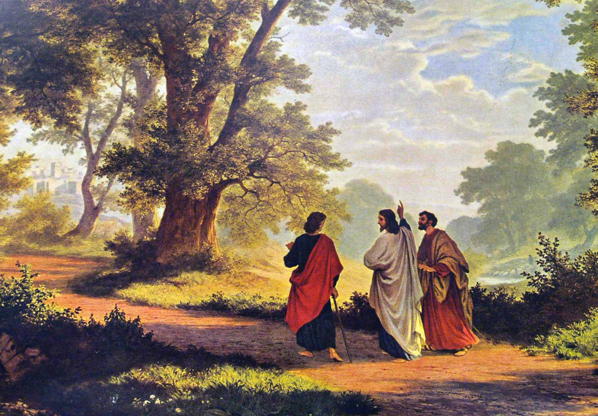

## Biblical Theology Knowledge Base

Welcome to **DaKnowledge** — a Catholic theological resource dedicated to the study of God, His revelation, and the life of grace. This knowledge base is organized around the great doctrines of the Christian faith, drawing from Sacred Scripture, the Church Fathers, the Magisterium, and the living Tradition of the Catholic Church.

> *"The Church does not draw her certainty about all revealed truths from the holy Scriptures alone. Both Scripture and Tradition must be accepted and honored with equal sentiments of devotion and reverence."*  
> — Dei Verbum, 9

---

## Theological Topics

Explore the major branches of Catholic theology:

### [Theology Proper](../theology-proper/)
The study of God the Father — His being, attributes, and names.
- [Attributes of God](../theology-proper/attributes-of-god.md) — Omnipotence, goodness, justice, mercy, love
- [Names of God](../theology-proper/names-of-god.md) — Yahweh, Elohim, Abba, and the revelation of the divine nature

### [The Trinity](../trinity/)
The central mystery of Christian faith — one God in three divine persons.
- [God the Father](../trinity/the-father.md) — The source and origin of all things
- [God the Son](../trinity/the-son.md) — The eternal Word incarnate
- [The Holy Spirit](../trinity/the-holy-spirit.md) — The Lord and Giver of life
- [Economic & Immanent](../trinity/economic-immanent.md) — How God acts in salvation and who He is in Himself

### [Christology](../christology/)
The study of Jesus Christ — true God and true man.
- [Hypostatic Union](../christology/hypostatic-union.md) — One person, two natures
- [Two Natures](../christology/two-natures.md) — Fully divine, fully human
- [Person of Christ](../christology/person-of-christ.md) — The Son of God incarnate
- [Work of Christ](../christology/work-of-christ.md) — Prophet, Priest, and King

### [Pneumatology](../pneumatology/)
The study of the Holy Spirit — His person and work.
- [Person of the Spirit](../pneumatology/person-of-the-spirit.md) — Divine person, not impersonal force
- [Work of the Spirit](../pneumatology/work-of-the-spirit.md) — Sanctification, inspiration, empowerment
- [Spiritual Gifts](../pneumatology/spiritual-gifts.md) — Gifts and fruits for the building up of the Church

### [Soteriology](../soteriology/)
The study of salvation — how God saves us in Christ.
- [Justification](../soteriology/justification.md) — Being made right with God
- [Sanctification](../soteriology/sanctification.md) — Being made holy
- [Atonement](../soteriology/atonement.md) — Christ's sacrifice for sin
- [Election](../soteriology/election.md) — Chosen in Christ before the foundation of the world

### [Ecclesiology](../ecclesiology/)
The study of the Church — the Body of Christ.
- [Nature of the Church](../ecclesiology/nature-of-the-church.md) — Body, temple, Bride, and sacrament
- [Church Government](../ecclesiology/church-government.md) — Papacy, bishops, priests, and deacons

### [Sacraments](../sacraments/)
The seven sacraments — efficacious signs of grace.
- [Baptism](../sacraments/baptism.md) | [Confirmation](../sacraments/confirmation.md) | [Eucharist](../sacraments/eucharist.md)
- [Reconciliation](../sacraments/reconciliation.md) | [Anointing of the Sick](../sacraments/anointing.md)
- [Holy Orders](../sacraments/holy-orders.md) | [Matrimony](../sacraments/matrimony.md)

### [Scripture](../scripture/)
The inspired Word of God.
- [Biblical Inspiration](../scripture/inspiration.md) — God-breathed and inerrant
- [Biblical Canon](../scripture/canon.md) — The 73 books of the Catholic Bible
- [Biblical Interpretation](../scripture/interpretation.md) — The four senses and principles of hermeneutics

### [Prayer](../prayer/)
The treasury of Christian prayer — liturgical, personal, contemplative, and devotional.

### [Relics](../relics/)
Holy remains and sacred objects that bear witness to the faith.

### [Spiritual Formation](../spiritual-formation/)
Resources for discipleship, growth, and the pursuit of holiness.

---

## About DaKnowledge

This knowledge base is organized around Catholic theological tradition with a focus on the **Triune God** — Father, Son, and Holy Spirit. Every doctrine flows from this center: the God who creates, redeems, and sanctifies.

All content is drawn from:
- The **Catechism of the Catholic Church**
- **Sacred Scripture** (the 73-book Catholic canon)
- The **Church Fathers** and Doctors of the Church
- The **Magisterium** and ecumenical councils
- The **liturgical tradition** of the Church

---

!!! tip "Begin Here"
    New to systematic theology? Start with [Theology Proper](../theology-proper/) to understand who God is in Himself, then move to [The Trinity](../trinity/) to see how the one God is three persons, and finally explore [Christology](../christology/) to encounter the Son who became man for our salvation.
